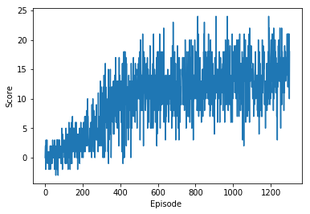
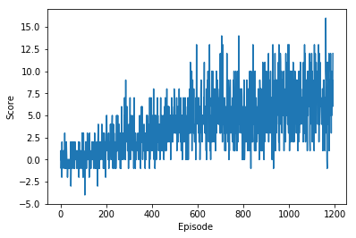

### Navigation (Navigation.ipynb)

Through episodes, agent interacts with the environment by taking actions and observing the changes coming back from the environment in form of reward, next_state and done variables. Rewards get accumulated per episode to teach the agent what action to take in specific states for maximum reward. For learning from rewards and penalties of its actions, agent uses 2 separate deep neural networks with exact same architectures, local and target networks, as well as a replay memory for using the experiences to improve its performance.
 * Replay buffer or Memory: keeps a buffer of states, actions, next_states and rewards for the target network
 * Target network: this network is initialized randomly at first and gets updated after memory is large enough. It picks batches of random samples from memory and tunes the weights and biases based on the experiences to acheive best action for a given state
 * Local network: takes a state as input and outputs an action, the goal is to minimize the error from Target network

The goal is to get an average score of +13 over 100 consecutive episodes.

* Model Architecture: 
 * 1- DQN agent is initialized with 
   * 2 FeedForward Networks as QN_local and QN_target
   * replay buffer 
   * starting epsilon 1.0 (e-greedy)
 * 2- agent observes its current state from the environment and calls act module 
   * it can randomly take an action or pass the state throught the QN_local network
   * at the beginning of the training agent has more chance to explore the environment becuase epsilon is closer to 1.0
   * but as epsilon gets smaller throught decaying process, there would be less chance for exploring and it'd use its experiences that gained through the QN_local network 
   * each episode decreases the epsilon value for making the process greedy until a minimum valu is reached
 * 3- action is passed to the environment and reward and the next state of the environment are returned
 * 4- agent sends the observations to step() module 
   * state, action, reward, next_state and done are added to replay buffer for the QN_target
   * if memory size has reached a threshold, agent collects a batch of random sample for learning for minimizing QN_local error and updating QN_target network
 * 5- here is the agent's learning process for the QN_target and minimizing QN_local error
    * sends samples to QN_target for target actions
    * sends samples to the QN_local for expected actions
    * minimizes the expected actions error from the target actions using an optimizer
    * updates QN_target
 * 6- agent continues episodes until it reaches the max episode
 * QNework consists of 4 feed forward layers:
    * fc1 : in:state_size, out:64
    * relu: activation for adding nonlinearity
    * fc2: in:64, out:512
    * relu: activation for adding nonlinearity
    * fc3: in:512, out:64
    * relu: activation for adding nonlinearity
    * fc4: in: 64, out: action_size
    * **Note**:I tried other combinations with different batch_sizes and learning_rates but this resulted in higher scores
    
  * Result:
    * Action Size:4, State Size:37
    * Episode: 100	Average Score: 0.57, score:3.00
    * Episode: 200	Average Score: 2.43, score:3.000
    * Episode: 300	Average Score: 4.50, score:2.000
    * Episode: 400	Average Score: 8.39, score:12.00
    * Episode: 500	Average Score: 10.36, score:15.00
    * Episode: 600	Average Score: 11.57, score:14.00
    * Episode: 700	Average Score: 11.68, score:7.000
    * Episode: 800	Average Score: 12.46, score:10.00
    * Episode: 900	Average Score: 13.26, score:7.000
    * Episode: 1000	Average Score: 13.14, score:12.00
    * Episode: 1100	Average Score: 13.88, score:12.00
    * Episode: 1200	Average Score: 12.90, score:13.00
    * Episode: 1300	Average Score: 14.96, score:10.00
    * Episode: 1301	Average Score: 15.04, score:18.00
  * Codes:
    * q_network.py
    * replay_buffer.py
    * dqn_agent.py
    

 
 

### Pixel Challenge Visual Banana: (Navigation_Pixels.ipynb)

This environment is almost identical to the previous environment, where the only difference is that the state is an 84 x 84 RGB image, corresponding to the agent's first-person view. select the environment that matches your operating system:
- Linux: [click here](https://s3-us-west-1.amazonaws.com/udacity-drlnd/P1/Banana/VisualBanana_Linux.zip)
- Mac OSX: [click here](https://s3-us-west-1.amazonaws.com/udacity-drlnd/P1/Banana/VisualBanana.app.zip)
- Windows (32-bit): [click here](https://s3-us-west-1.amazonaws.com/udacity-drlnd/P1/Banana/VisualBanana_Windows_x86.zip)
- Windows (64-bit): [click here](https://s3-us-west-1.amazonaws.com/udacity-drlnd/P1/Banana/VisualBanana_Windows_x86_64.zip)

#### Experiment 1 

For this experiment, model is trained on Tesla k80 instance but cuda ran out of memory after 1129 episodes with avergae score of 6.15, which I beleive it could go higher if I could resolve gpu memory problem like adding elastic gpus or do parallel computing in pytorch.
* Codes:
    * q_network_cnn.py
    * replay_buffer.py (same as previous navigation)
    * dqn_agent.py (same as previous navigation)

* QNetwork Architecture:
    * For each iteration, 3 input image frames are stacked and resized to 32x32x3, color channels are kept to improve color detection. Grayscaling images would lose a lot of infromation from them image frames as yellow belnds in floor and background.
    * input_shape: 1x3x3x32x32 (used deque for stacking frames)
    * learning_rate = 0.001 , batch_size = 512
    * conv3d layer1: in_channels=3, out_channels=10, kernel_size=(1,5,5), stride=1
    * Relu layer
    * Maxpool3d: kernel_size=(1,2,2)
    * size calculation : 32x32x3 -> 28x28x10 -> 14x14x10
    * conv3d layer2: in_channels=10, out_channels=32, kernel_size=(1,5,5) , stride=1
    * Relu layer
    * Maxpool3d: kernel_size=(1,2,2)
    * size calculation : 14x14x10 -> 10x10x32 -> 5x5x32
    * fully connected layer: action_size
    
* Result:
    * Episode: 100	Average Score: 0.01
    * Episode: 200	Average Score: 0.132
    * Episode: 300	Average Score: 0.90
    * Episode: 400	Average Score: 1.07
    * Episode: 500	Average Score: 1.83
    * Episode: 600	Average Score: 2.34
    * Episode: 700	Average Score: 3.25
    * Episode: 800	Average Score: 4.59
    * Episode: 900	Average Score: 5.35
    * Episode: 1000	Average Score: 5.63
    * Episode: 1100	Average Score: 6.32
    * Episode: 1129	Average Score: 6.15
    
* Exception: RuntimeError: CUDA error: out of memory

#### Experiment 2

I reduced the image size to 28x28x3 and ran the same model which also needed more gpu memory but I saved it with 7 max score, result:

 * Episode: 100	Average Score: 0.14
 * Episode: 200	Average Score: 0.66
 * Episode: 300	Average Score: 1.97
 * Episode: 400	Average Score: 2.35
 * Episode: 500	Average Score: 3.29
 * Episode: 600	Average Score: 4.37
 * Episode: 700	Average Score: 5.35
 * Episode: 800	Average Score: 5.23
 * Episode: 900	Average Score: 4.66
 * Episode: 1000	Average Score: 6.21
 * Episode: 1100	Average Score: 6.34
 * Episode: 1193	Average Score: 7.07

 * Exception: RuntimeError: CUDA error: out of memory
 
 

 
 
### Future Work

* applying Double DQN which handles the problem of the overestimation of Q-values
* Deuling DQN: by implementing 2 separate estimators:
  * estimating the state value V(s)
  * estimating the advantage for each action A(s,a) 
* prioritized experience replay: the idea is that some experiences may be more important than others for our training, but might occur less frequently.
changing the sampling distributiin we try to change by using a criterion to define the priority of each tuple of experience can improve the learning process
* Parallel gpu processing in pytorch can improve the memory issues and acheive higher score
